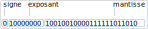

Exercices
=========

Pour les exercices on donne le tableau de puissances de 2 suivant:

.. csv-table::
   :file: ../csv/puissances_deux.csv
   :delim: ;
   :class: border-style-solid border-width-1

Exercice 1
----------

Les nombres binaires sont à virgule fixe.

#. Donner la valeur en écriture décimale des nombres :

   a. :math:`111,1`
   b. :math:`10000000,00000001`
   c. :math:`0,111`

#. Donner l'écriture en virgule flottante des nombres précédents.

Exercice 2
----------

On donne une méthode pour convertir un nombre en écriture décimale en écriture binaire avec une virgule fixe.

-  On convertit la partie entière (avant la virgule) comme la conversion d'un entier (non signé).
-  Pour la partie décimale (après la virgule), on applique l'algorithme suivant::
      
      tant que la partie décimale est différente de 0:

      -  on multiplie par 2 la partie décimale;
      -  le chiffre avant la virgule est la valeur du bit cherché;
      -  on recommence avec la partie décimale du résultat calculé précédemment.

On donne un exemple pour convertir :math:`2,625` en binaire.

Le nombre :math:`2` se convertit :math:`10` en binaire. Appliquons l'algorithme pour :math:`0,625`

-  :math:`0,625 \times 2 = 1,25` donc le premier bit après la virgule vaut 1; on recommence avec :math:`0,25`
-  :math:`0,25\times 2 = 0,5` donc le deuxième bit après la virgule vaut 0; on recommence avec :math:`0.5`
-  :math:`0,5 \times 2 = 1,0` donc le troisième bit après la virgule vaut 1; la partie décimale est 0, on arête.

Conclusion : :math:`2,625_{10} = 10,101_{2}`

#. Donner l'écriture binaire du nombre :math:`5,6875_{10}`.
#. Donner l'écriture binaire du nombre :math:`-13,15625_{10}`.
#. Donner l'écriture binaire du nombre :math:`0,2_{10}`. Que remarque-t-on ?

Exercice 3
----------

On donne le nombre dont la représentation binaire suit la norme IEEE 754.

Quelle est la valeur décimale de ce nombre ?

Exercice 4
----------

On donne ci-après un algorithme de conversion d'un nombre flottant :math:`x`:

.. code-block:: text

   on convertit la partie entière de x (vu précédemment).

   on soustrait la partie entière de x à x (nombre inférieur ou égal à 1)
   soit d la partie décimale de x

   tant que d est différent de 0:
      d=d*2
      si d >= 1 alors :
         d=d-1
         le chiffre binaire vaut 1
      sinon
         le chiffre binaire vaut 0 

Écrire un script en Python qui affiche la représentation binaire en virgule fixe.
